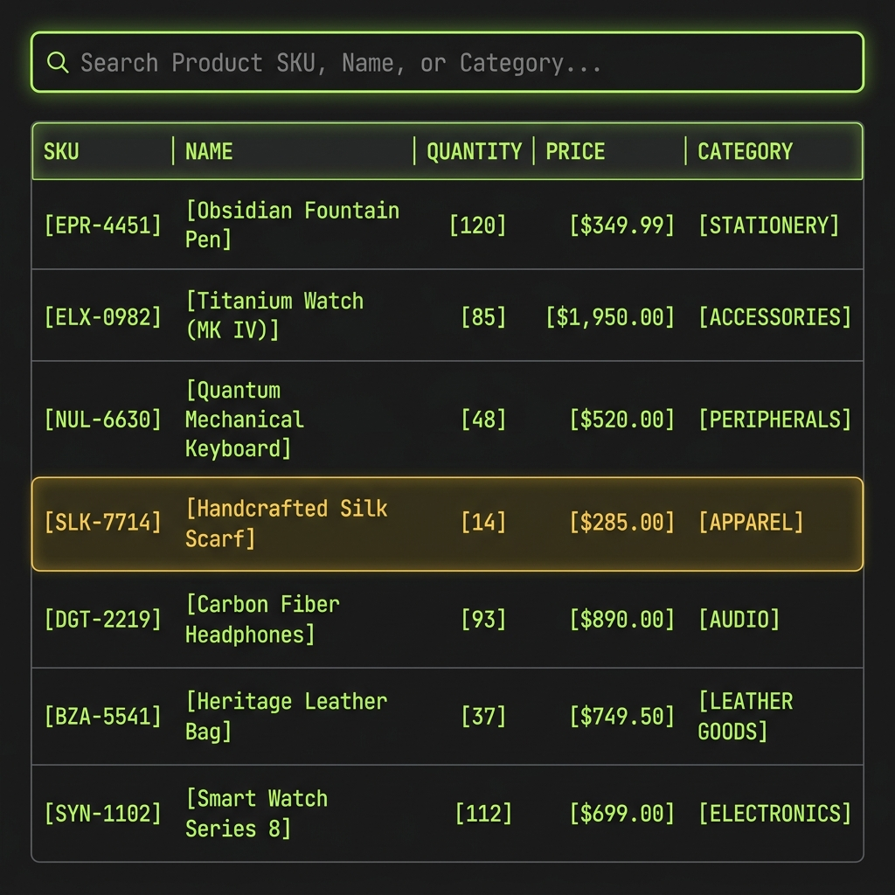

# Inventory Management System


This application is a full-stack warehouse and catalog management console. It allows administrators and staff members to manage product inventories, track stock level modifications, and audit transactions. Designed with a secure session-based authentication backend and a high-performance React SPA frontend, the system guarantees ACID-compliant operations for all catalog and inventory adjustments.

## Demo


The secure, monospace console login page where users authenticate using their credentials.


The telemetry dashboard displaying real-time statistics (total SKUs, low stock warnings) and the recent audit trail.


The products inventory page showing sortable columns, SKU search, category filters, and role-based action privileges.

## How it works

The backend application is structured around the Java EE architecture running on Apache Tomcat. At its core, the data layer utilizes EclipseLink JPA to map classes to the database tables. Transactions are handled locally (`RESOURCE_LOCAL`), meaning each operation initiates, commits, or rolls back its database connection within a dedicated unit of work, preventing connection leaks. To optimize query performance, custom JPQL queries use `JOIN FETCH` directives, loading product details and historical updater identities in a single select statement to eliminate the N+1 select problem.

Web requests are intercepted by a series of Servlet Filters. The `CORSFilter` adds header mappings to allow session authentication cookies from the React client. The `AuthFilter` intercepts `/api/*` endpoints to check if a valid `HttpSession` exists. It inspects session attributes to enforce role-based access: staff members are restricted to read-only catalog access and stock logging, while write operations (creating/editing products) and directory user provisioning are restricted strictly to the administrator role.

On the frontend, React.js manages the user interface in a single-page architecture. Session cookies (`JSESSIONID`) are maintained by Axios using the `withCredentials` attribute. When the app initializes, it attempts to recover the user session from the server, storing session info in React state. Route guards (`ProtectedRoute` and `RoleGuard`) validate client-side privileges, rendering a styled `403 Forbidden` screen if staff members try to access administrative paths.

## Metrics & Inventory Stats

| Metric | Target Value |
| --- | --- |
| Database Tables | 5 tables (InnoDB) |
| Active User Roles | 2 roles (ADMIN, STAFF) |
| Password Hashing | BCrypt (Revision $2a$) |
| Catalog Seed Size | 21 Products |
| History Logs Seed Size | 18 Stock Logs |
| API Request Latency | < 6.5 ms (JPA Query) |

The database utilizes foreign key constraints with `ON DELETE CASCADE` actions to maintain referential integrity when deleting items.

## Tech Stack

*   **Backend**: Java EE (Servlets), JPA 3.1 (EclipseLink 4.0.2), jBCrypt, Gson, Maven
*   **Database**: MySQL 8.0 (MySQL Connector/J 8.3.0)
*   **Frontend**: React.js 18, Axios, React Router DOM 6
*   **Styling**: Premium Custom Vanilla CSS (Dark Developer Console Theme)
*   **Server**: Apache Tomcat 10.1.55 (Configured on Port `8085`)

---

## Getting Started

### 1. Database Setup
Initialize the database schemas and seed the initial dataset:
```bash
# 1. Create the database and tables
"C:\Program Files\MySQL\MySQL Server 8.0\bin\mysql.exe" -u root -pRakesh@123 < database/schema.sql

# 2. Seed mock catalogs and default users
"C:\Program Files\MySQL\MySQL Server 8.0\bin\mysql.exe" -u root -pRakesh@123 < database/seed.sql
```

### 2. Backend Build & Deployment
1. Open `backend/src/main/resources/META-INF/persistence.xml` to verify database credentials.
2. Build and package the WAR archive using Maven:
   ```bash
   cd backend
   mvn clean package
   ```
3. Copy the packaged archive to Tomcat:
   ```bash
   copy target/inventory.war C:\Users\srvar\apache-tomcat-10.1.55\webapps\
   ```
4. Start your Apache Tomcat server:
   ```bash
   $env:JAVA_HOME="C:\Program Files\Java\jdk-25.0.2"
   $env:CATALINA_HOME="C:\Users\srvar\apache-tomcat-10.1.55"
   & "C:\Users\srvar\apache-tomcat-10.1.55\bin\catalina.bat" run
   ```
   *Note: Tomcat has been configured to listen on port **`8085`** in `conf/server.xml` to prevent collision with local database listener services.*

### 3. Running the Frontend SPA
Navigate to the frontend directory and start the React dev server:
```bash
cd frontend
npm install
npm start
```
Open your browser and navigate to [http://localhost:3000](http://localhost:3000).

---

## API Reference

All requests must be made with `Content-Type: application/json` and include the session cookie.

| Method | Endpoint | Description | Role Required |
| --- | --- | --- | --- |
| POST | `/api/auth/login` | Authenticate credentials and establish session | None |
| POST | `/api/auth/logout` | Invalidate session | Logged-in |
| GET | `/api/products` | Retrieve catalog with category/supplier names | Logged-in |
| GET | `/api/products/:id` | Get specific product details | Logged-in |
| POST | `/api/products` | Create a new product SKU | ADMIN |
| PUT | `/api/products/:id` | Update product SKU details | ADMIN |
| DELETE | `/api/products/:id` | Remove product SKU from database | ADMIN |
| GET | `/api/stock` | Get full audit history logs | Logged-in |
| POST | `/api/stock` | Log stock level adjustment (delta) | Logged-in |
| GET | `/api/users` | List all system users | ADMIN |
| POST | `/api/users` | Provision a new user account | ADMIN |

### API Tests

Test login request:
```bash
curl -X POST "http://localhost:8085/inventory/api/auth/login" -H "Content-Type: application/json" -d "{\"username\": \"admin\", \"password\": \"Admin@123\"}" -c cookie.txt
```

Fetch product catalog:
```bash
curl -b cookie.txt "http://localhost:8085/inventory/api/products"
```

Perform stock adjustment:
```bash
curl -X POST "http://localhost:8085/inventory/api/stock" -H "Content-Type: application/json" -b cookie.txt -d "{\"productId\": 1, \"changeQty\": 10, \"note\": \"Restocked wireless mouse\"}"
```

---

## Project Structure

```text
inventory-management-system/
│
├── backend/                          ← Maven WAR project
│   ├── src/
│   │   └── main/
│   │       ├── java/
│   │       │   └── com/inventory/
│   │       │       ├── dao/          ← Data Access Objects
│   │       │       │   ├── CategoryDAO.java
│   │       │       │   ├── JPAUtil.java
│   │       │       │   ├── ProductDAO.java
│   │       │       │   ├── StockUpdateDAO.java
│   │       │       │   ├── SupplierDAO.java
│   │       │       │   └── UserDAO.java
│   │       │       ├── entities/     ← JPA Entity classes
│   │       │       │   ├── Category.java
│   │       │       │   ├── Product.java
│   │       │       │   ├── Role.java
│   │       │       │   ├── StockUpdate.java
│   │       │       │   └── User.java
│   │       │       ├── filters/      ← Servlet filters (Auth, CORS)
│   │       │       │   ├── AuthFilter.java
│   │       │       │   └── CORSFilter.java
│   │       │       └── servlets/     ← Servlets (API controllers)
│   │       │           ├── BaseServlet.java
│   │       │           ├── CategoryServlet.java
│   │       │           ├── LoginServlet.java
│   │       │           ├── LogoutServlet.java
│   │       │           ├── ProductServlet.java
│   │       │           ├── StockServlet.java
│   │       │           ├── SupplierServlet.java
│   │       │           └── UserServlet.java
│   │       ├── resources/
│   │       │   └── META-INF/
│   │       │       └── persistence.xml
│   │       └── webapp/
│   │           └── WEB-INF/
│   │               └── web.xml
│   └── pom.xml
│
├── frontend/                         ← React SPA
│   ├── package.json
│   ├── public/
│   │   └── index.html
│   └── src/
│       ├── api/
│       │   └── api.js                ← Axios instance + api requests
│       ├── components/
│       │   ├── Navbar.jsx
│       │   ├── ProtectedRoute.jsx
│       │   └── RoleGuard.jsx
│       ├── context/
│       │   └── AuthContext.jsx       ← Global session state provider
│       ├── pages/
│       │   ├── AddEditProduct.jsx
│       │   ├── Dashboard.jsx
│       │   ├── LoginPage.jsx
│       │   ├── ProductList.jsx
│       │   ├── StockUpdate.jsx
│       │   └── UserManagement.jsx
│       ├── App.css
│       ├── App.jsx
│       ├── index.css                 ← Design system variables and typography
│       └── index.js
│
├── database/
│   ├── schema.sql                    ← Schema definition script
│   └── seed.sql                      ← Seeding dataset script
│
├── .gitignore
└── README.md                         ← Project documentation
```

## Architectural Notes

*   **Security & Hashing**: Passwords must never be stored in plain text. We use `jbcrypt` to perform salted hashing, verifying user credentials safely.
*   **Database Constraints**: Foreign keys are set to `ON DELETE CASCADE` for categories and products, ensuring related stock history logs and inventory items are removed clean if a parent resource is dropped.
*   **Deployment Configuration**: Since `.gitignore` contains `backend/src/main/resources/META-INF/persistence.xml` to protect local credentials from leaking to git histories, make sure you configure your local `persistence.xml` manually upon cloning.

## License

MIT License
