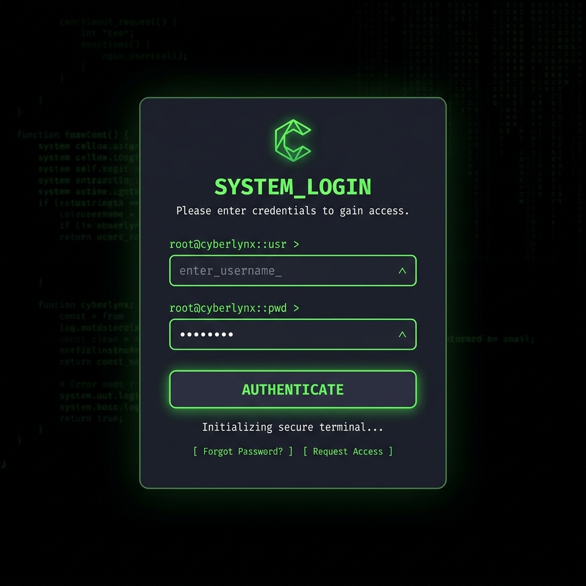
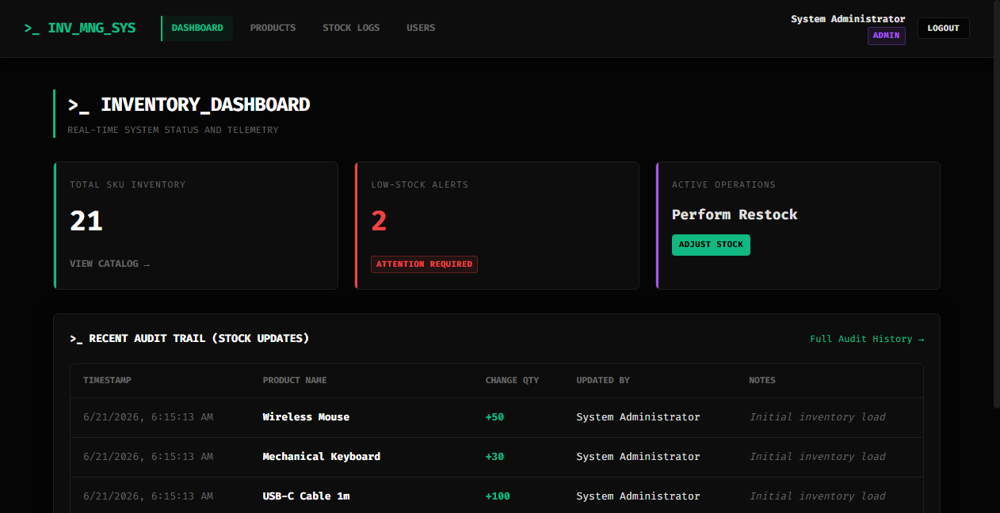
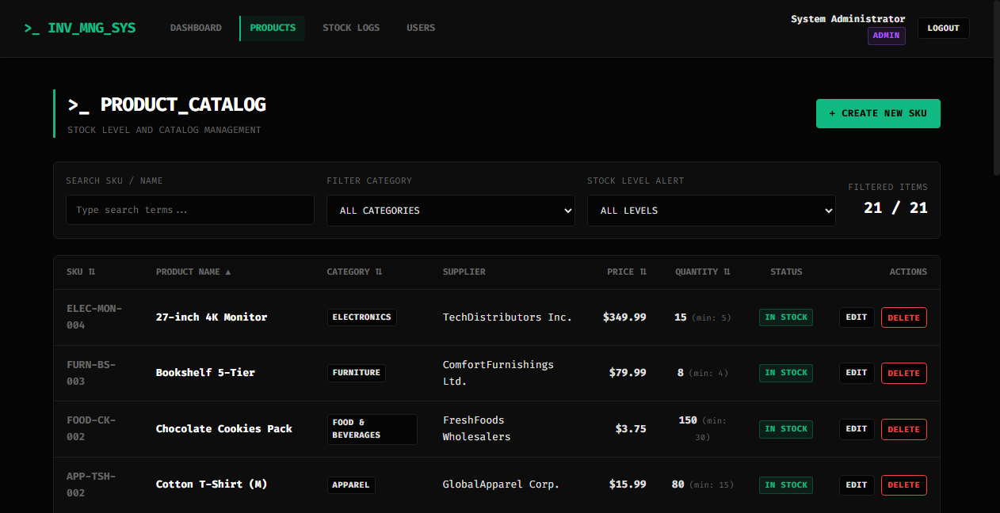

# Warehouse Inventory Management

A developer-centric console to track products, stock levels, and audit trail changes using React and a Java EE/JPA backend.

## Screenshots







## What it does

I wrote this application to track catalog items, log stock level changes, and keep audit logs in real-time. The server writes immutable entries to the database for every change, linking updates directly to the logged-in user. It restricts staff users to logging transactions and viewing the catalog, while reserving product creation and user registration for administrator accounts. All changes sync between the single-page React interface and the Tomcat/JPA backend.

## Tech Stack

| Layer | Technology |
| --- | --- |
| Frontend | React 18, Axios, React Router 6 |
| Backend | Java EE, JPA 3.1 (EclipseLink 4), Maven |
| Database | MySQL 8.0 |
| Web Server | Apache Tomcat 10.1.55 (Port 8085) |

## Project Structure

```
INV-MNG-SYS/
├── backend/
│   ├── src/
│   │   ├── main/
│   │   │   ├── java/com/inventory/        # Application source code
│   │   │   └── resources/META-INF/        # persistence.xml configuration
│   │   └── webapp/WEB-INF/                # web.xml servlet declarations
│   └── pom.xml
├── database/
│   ├── schema.sql                         # Database tables schema
│   └── seed.sql                           # Seed users, products, suppliers
├── docs/
│   └── screenshots/                       # Actual application screenshots
└── frontend/
    ├── public/
    ├── src/
    │   ├── api/
    │   ├── components/
    │   ├── context/
    │   ├── pages/
    │   └── index.css                      # Vanilla CSS dark console style
    └── package.json
```

## How to Run

### 1. Database Setup
Run the following commands to initialize the schema and populate seed data:
```bash
"C:\Program Files\MySQL\MySQL Server 8.0\bin\mysql.exe" -u root -pRakesh@123 < database/schema.sql
"C:\Program Files\MySQL\MySQL Server 8.0\bin\mysql.exe" -u root -pRakesh@123 < database/seed.sql
```

### 2. Backend Deployment
Compile the Java EE application and deploy it to Apache Tomcat:
```bash
cd backend
mvn clean package
copy target/inventory.war C:\Users\srvar\apache-tomcat-10.1.55\webapps\
```
Start the Tomcat server:
```bash
$env:JAVA_HOME="C:\Program Files\Java\jdk-25.0.2"
$env:CATALINA_HOME="C:\Users\srvar\apache-tomcat-10.1.55"
& "C:\Users\srvar\apache-tomcat-10.1.55\bin\catalina.bat" run
```

### 3. Frontend Startup
Install the dependencies and boot the React development server:
```bash
cd ../frontend
npm install
npm start
```
Open [http://localhost:3000](http://localhost:3000) in your browser.

## Default Credentials

| Username | Password | Role | Access Level |
| --- | --- | --- | --- |
| admin | Admin@123 | ADMIN | Full read/write access and user provisioning |
| staff | Staff@123 | STAFF | Read-only catalog view and stock level adjustments |

## Database Schema

The database holds five relational tables with foreign keys configured to maintain referential integrity:
- `users`: Stores user accounts, passwords hashed with BCrypt ($2a$), and their roles.
- `categories`: Defines groups like Electronics or Furniture to classify catalog items.
- `suppliers`: Contains contact information and emails for inventory vendors.
- `products`: Holds individual items, their current quantity, SKU, and low-stock warning limits.
- `stock_updates`: Captures an audit log of every quantity change, tracking who adjusted what.

## API Endpoints

| Method | Endpoint | Description | Role Required |
| --- | --- | --- | --- |
| POST | `/api/auth/login` | Authenticate credentials and establish session | None |
| POST | `/api/auth/logout` | Terminate session | Authenticated |
| GET | `/api/products` | Retrieve catalog list | Authenticated |
| POST | `/api/products` | Create a new catalog item | ADMIN |
| PUT | `/api/products` | Update details of a catalog item | ADMIN |
| DELETE | `/api/products` | Remove a catalog item | ADMIN |
| GET | `/api/categories` | Retrieve all categories | Authenticated |
| GET | `/api/suppliers` | Retrieve all suppliers | Authenticated |
| GET | `/api/stock` | Retrieve historical audit trail logs | Authenticated |
| POST | `/api/stock` | Log quantity changes | Authenticated |
| GET | `/api/users` | List system users | ADMIN |
| POST | `/api/users` | Register a new user | ADMIN |

## Limitations & Future Work

- I used in-memory local session storage on Tomcat which means session state will clear if the server restarts.
- EclipseLink cache sometimes requires a Tomcat reboot to sync direct SQL modifications done outside the app.
- Adding pagination to the products catalog would improve response times once the inventory expands.
